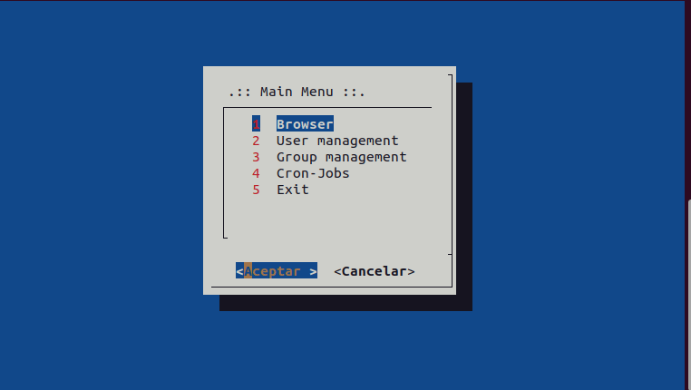

# Navex
Terminal light wright file explorer interface made with dialog.

> Note: Only debian derived systems have been tested

## Dependencies

### Requirements
* _dialog_ - window system on which Navex is based
* _finger_ - obtain user info from system
* _expect_ - help to modify user password (under testing)

> **Note**: This dependencies will be checked with installation script

## Installation

* You can use the following script to install this explorer and its dependencies.

```shell
sudo git clone https://github.com/mfruizs/navex.git && cd navex && sudo chmod +x installer.sh && sudo ./installer.sh
```

* Once the installation is finished, we must execute the following command to be able to use Navex from any part of the system

```shell
export PATH="$PATH:/usr/local/bin/navex"
```

## Running

* After installation, only need call the script.

```shell
navex.sh
```

## Execution examples

### Browser
* From here we can manage the files and folders, creating or deleting, it also allows the installation of `*.deb` 
or view the content of files as if using the `cat` command.



### User manager

* This section is for the management of users in the system.


### Groups and Cronjob

* Finally, we have the management of the groups, as well as the jobs that are active in the cron, 
as well as being able to add our own jobs.

